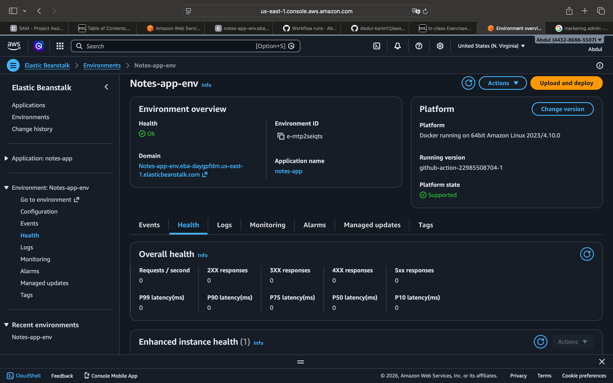
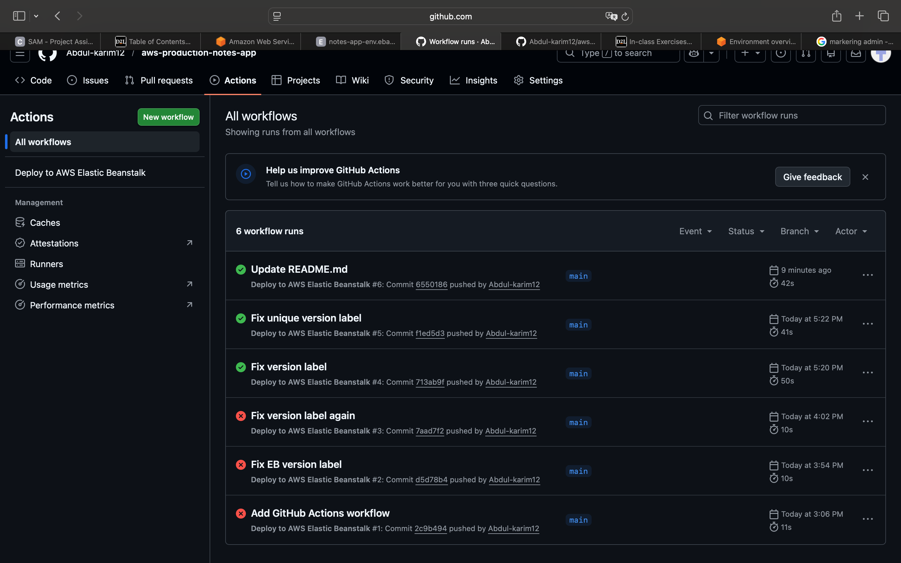

# AWS CI/CD Notes Application

This project was developed as part of a college cloud computing project to demonstrate a real-world CI/CD deployment pipeline using AWS and GitHub Actions.

## Project Overview

The application is a simple Python notes app that is automatically deployed to AWS whenever new code is pushed to GitHub.

This demonstrates how modern production systems automate software deployment.

## Technologies Used

• Python (Flask)  
• Docker  
• AWS Elastic Beanstalk  
• GitHub Actions  
• CI/CD Pipeline  
• GitHub Secrets for secure credentials  

## CI/CD Pipeline

The deployment pipeline works as follows:

1. Code is pushed to GitHub
2. GitHub Actions automatically runs a workflow
3. The workflow creates a deployment package
4. AWS Elastic Beanstalk deploys the new version of the app

This pipeline simulates how production systems automatically deploy applications.

## Learning Outcomes

Through this project I learned:

• How to build a CI/CD pipeline  
• How GitHub Actions automates deployments  
• How to deploy applications to AWS Elastic Beanstalk  
• How to manage cloud credentials securely  

## Automated Deployment Pipeline

This project uses a CI/CD pipeline that automatically deploys the application to AWS Elastic Beanstalk whenever code is pushed to GitHub.

### GitHub Actions Deployment Workflow

### Running AWS Elastic Beanstalk Environment

## Author
Abdulkarim Elezeb  
Computer Science Student
